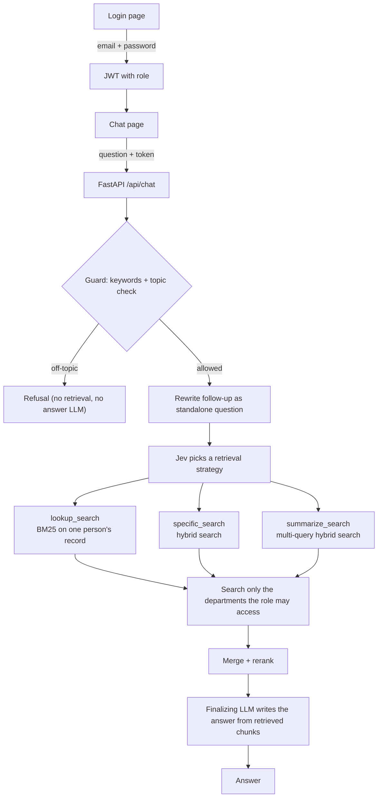

# Enterprise RAG System with RBAC

An internal knowledge assistant for company documents. Employees ask questions in plain language and get answers drawn only from the departments their role is allowed to see.

**Live demo:** https://enterprise-rag-system-rbac.onrender.com/chat
The demo runs on a free tier, so sometimes the first load after a quiet period can take about a minute.

---

## Features

- **Role-based access control.** The user's role is stored in a signed JWT, and every search is restricted to the departments that role may access.
- **Three retrieval strategies, chosen per question.** A typed decision model (Jev) picks exact lookup, hybrid search or multi-query search for each question.
- **Two-layer guardrail.** A keyword filter and an LLM topic check block off-topic and general-knowledge questions before any retrieval or answer generation runs.
- **Conversation memory.** Each chat session keeps its own history, and follow-ups like "who is her manager?" are rewritten into standalone questions.
- **LLM key pool.** Several Groq API keys are rotated with automatic failover when one is rate-limited.
- **Readable answers.** Replies render as markdown (tables, lists, bold), and the chat page has a built-in test panel with example questions per role.

---

## How it works



### Retrieval strategies

| Question type | Strategy | Example |
|---|---|---|
| About one named person (employee ID, email, full name) | `lookup_search`: BM25 | "Who is FINEMP1078?" |
| Direct question that uses the document's own terms | `specific_search`: hybrid | "What is the leave policy?" |
| Situation in everyday words, or needs several sections | `summarize_search`: multi-query hybrid | "Why was my leave rejected?" |

### Guardrails

1. **Keyword filter.** A small regex blocklist for clearly abusive or malicious terms. It costs nothing and runs first.
2. **Topic check.** Jev classifies the question as `company`, `off_topic` or `unclear`. Names and IDs are treated as possible colleagues, so questions about people are never mistaken for celebrity questions. If the check fails or is unsure, the question goes through.

The guard saves tokens and keeps the bot on topic. It is not the access-control layer. Access is enforced in retrieval, where only the allowed departments are searched.

---

## Department access

| Role | Financial | HR | Engineering | Marketing | General |
|---|:-:|:-:|:-:|:-:|:-:|
| admin | yes | yes | yes | yes | yes |
| finance | yes | | | | yes |
| hr | | yes | | | yes |
| engineering | | | yes | | yes |
| marketing | | | | yes | yes |
| employee | | | | | yes |

The mapping lives in `rbac.py` (`ROLE_PERMISSIONS`).

---

## Tech stack

| Layer | Technology |
|---|---|
| Backend | FastAPI, Uvicorn |
| Orchestration | LangGraph, LangChain |
| Answer LLM | Groq `openai/gpt-oss-120b` |
| Follow-up rewrite LLM | Groq `openai/gpt-oss-20b` |
| Guard and strategy router | Jev (TypeSafe) via OpenRouter |
| Embeddings | Jina Embeddings v3 |
| Vector store | ChromaDB, one collection per department |
| Keyword search | rank-bm25 |
| Auth | JWT (`python-jose`, HS256) |
| Frontend | HTML, CSS, vanilla JavaScript (marked + DOMPurify for markdown) |
| Hosting | Render |

---

## Project structure

```
.
├── main.py              # FastAPI app: login, chat, health, page routes
├── agent.py             # LangGraph pipeline: guard -> rewrite -> RAG, session memory
├── rag.py               # Strategy router, retrieval, finalizing agent
├── llm_pool.py          # Groq key rotation with failover
├── rbac.py              # Role -> department permissions
├── eval_rag.py          # Retrieval + answer evaluation
├── eval_langsmith.py    # Same evaluation as a LangSmith experiment
├── eval_dataset*.json   # Golden question sets
├── RESULTS.md           # Full evaluation results
├── ingest.py            # Loads documents, chunks them, builds chroma_db
├── prompts.py           # Prompt templates
├── retrieval_methods/   # Hybrid, BM25 and multi-query search
├── resources/           # Source documents (hr, financial, engineering, marketing, general)
├── chroma_db/           # Vector database built by ingest.py
├── FRONTEND/
│   ├── login.html / login.js
│   ├── chat.html / chat.js
│   └── style.css
├── requirements.txt
└── .env.example
```

---

## Run locally

```bash
git clone https://github.com/Irfan-gitt/Enterprise-RAG-System-RBAC-
cd Enterprise-RAG-System-RBAC-

python -m venv venv
# Windows: venv\Scripts\activate    macOS/Linux: source venv/bin/activate
pip install -r requirements.txt

cp .env.example .env        # then fill in your keys

python ingest.py --reset    # builds chroma_db (skip if chroma_db/ is already in the repo)
uvicorn main:app --reload
```

Open http://127.0.0.1:8000

### Environment variables

| Variable | Purpose |
|---|---|
| `GROQ_API_KEY_1` .. `GROQ_API_KEY_3` | Groq keys used by the LLM pool. One is enough, and more add failover. |
| `OPENROUTER_API_KEY` | Access to Jev for the guard and strategy router |
| `JINA_API_KEY` | Jina embeddings |
| `JWT_SECRET_KEY` | Secret used to sign login tokens. Set a long random value. |

Generate a secret with:

```bash
python -c "import secrets; print(secrets.token_urlsafe(48))"
```

---

## Demo accounts

Password for all accounts: `demo123`

| Email | Role |
|---|---|
| employee@company.com | employee |
| hr@company.com | hr |
| finance@company.com | finance |
| engineering@company.com | engineering |
| marketing@company.com | marketing |
| admin@company.com | admin |

The role comes from the signed token, never from the browser.

---

## Try it

After signing in, the chat page shows a **test panel** with clickable example questions for your role, plus an **Access test** question that your role should be refused. It also links to the source documents your role can see, so you can check each answer against the original files.

Some questions worth trying:

- HR: "List the DevOps engineers working in Bengaluru"
- Finance: "How did revenue grow from Q1 to Q4 2024?"
- Engineering: "A test fails randomly then passes, what does the pipeline do?"
- Any role, to test the guard: "Who is Cristiano Ronaldo?"

---

## API

| Method | Path | Description |
|---|---|---|
| POST | `/api/auth/login` | Body `{email, password}`. Returns `{access_token, user}`. |
| POST | `/api/chat` | Header `Authorization: Bearer <token>`. Body `{question, conversation_id?}`. Returns `{answer, conversation_id}`. |
| GET | `/api/health` | Returns `{"status": "ok"}` |

Send the returned `conversation_id` back with the next question to keep the same memory. Sessions are keyed per user, so one user cannot open another user's conversation.

---

## Deployment (Render)

- **Build command:** `pip install -r requirements.txt`
- **Start command:** `uvicorn main:app --host 0.0.0.0 --port $PORT`
- **Environment:** add every variable from the table above in the Render dashboard. The `.env` file is not deployed.
- **Data:** commit `chroma_db/` and `resources/`, because the server starts with an empty disk.
- Run a **single worker**. Session memory lives inside the process.

---

## Evaluation

The retrieval and answer quality were measured on hand-written question sets about the engineering document, scored with `eval_rag.py` and tracked as LangSmith experiments (`eval_langsmith.py`). Full per-question results, method and limitations are in [RESULTS.md](RESULTS.md).

**RAG: direct questions** (13 questions, hybrid search, top 10)

| Metric | Score |
|---|---|
| Recall@10 | 1.00 |
| MRR | 0.84 |
| Precision@10 | 0.11 |
| Faithfulness | 0.86 |
| Correctness | 1.00 |
| Relevance | 1.00 |

Precision is low by design: each question has one or two correct sections and 10 chunks are returned.

**RAG: indirect questions** (situations in everyday words, such as "our cloud bill keeps going up, who checks it?")

| Metric | Score (11 of 12 questions run) |
|---|---|
| Recall@10 | 0.83 |
| MRR | 0.45 |
| Correctness | 0.79 |
| Relevance | 0.92 |
| Faithfulness | 0.89 |


**Guardrails and router:** the Jev topic check classified 14 of 15 labeled questions correctly (93%), and the strategy router picked the right retrieval method for every labeled question (100%).

**Agent end to end (role isolation):** in testing through the chat API, no question returned data from a department the user's role cannot access. Latency and per-question cost are not measured yet and are listed as open items in RESULTS.md.

**What the evaluation caught:** retrieval returned nothing when reranking was off, and the engineering role sometimes searched only the `general` department because the role mapping is an unordered set. Both are fixed, and recall on the indirect set went from 0.00 to 0.83.

**Caveats:** the sets are small, and the answer model also acts as the judge, so treat the scores as a guide, not a benchmark.


Detailed Eval Result Are In [EVALUATIONS/EVALUATION.md]
---

## Limitations and next steps

- Demo users are hardcoded with a shared password. A real deployment needs a user database, hashed passwords or an identity provider, with the role mapped from the account.
- Session memory is in-process (`InMemorySaver`), so it resets on restart. A Postgres or Redis checkpointer would persist it.
- Logout only removes the token in the browser. Tokens are valid until they expire (120 minutes). Refresh tokens and revocation are the upgrade path.
- No response caching yet.
- Answers reflect the source documents, including conflicts between them.

---

Built by [Irfan](https://github.com/Irfan-gitt)
